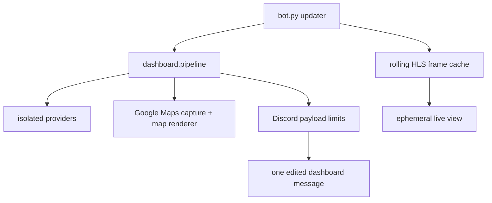

# Dashboard architecture

bot.py owns the Discord runtime: configuration, the presentation scheduler,
generation fencing, persistent-message discovery and recovery, status threads,
alerts, live-view button interactions, durable state, and the updater-owned
camera refresh task. It receives completed snapshots from dashboard.pipeline
and edits one message in place.

dashboard.pipeline coordinates isolated provider calls using the injected
HttpClient. Transit, weather, traffic, and tracked-road results can publish
retained or fresh data independently. Route geometry is refreshed and consumed
by the map stage; it is not one of collect_all's published provider results.
Presentation defaults to a 10-second interval; provider refresh gates are
longer and independent. The map stage combines transit estimates, route
geometry, traffic evidence, and the latest completed Google Maps Playwright
capture before adapting the result for dashboard.render.

Map results carry separate canvas-export and verified-page timestamps through
the renderer. The active page is exported each 10-second presentation cycle;
a second page warms in the background and replaces it only after complete,
stable canvas checks. The page/base has a hard one-minute lifetime, independent
of repeated exports. Failed captures retry after 10 seconds; retained fallback
is labelled, and exports older than 30 seconds are stale. Neither render time
nor disk writes can extend the verified page's freshness.
The separate "Markers refreshed" clock records overlay rendering and never
extends the Google base's lifetime. The legend shows live ETA samples for all
operators and scheduled samples for KMB and GMB only.

Traffic notices combine TD's full special-news page and RTHK's current Chinese
traffic-news page, independently cached for 60 seconds. The incomplete special
news XML feed is excluded from runtime collection; it cannot establish the
current active list. Reports are attributed and
matched by road aliases in their text. Clearance reports remain visible, but
do not produce affected-road rails or congestion role pings. Each TD report
carries the page update clock, explicitly distinguished from RTHK's per-report
publication time. The two TD locale pages are fetched concurrently: equal page
clocks/counts and unique road/cause/state pairs permit official Chinese sidecars.
Cross-source grouping additionally requires exact direction/landmark/state and
a unique report pair within three hours. Grouping retains both attributed texts;
ambiguous or conflicting reports stay separate. Source checks remain internal
freshness metadata rather than a repeated timestamp on each link.

dashboard.providers.traffic_location resolves explicit landmarks using exact
bilingual names from LandsD Location Search and converts HK80 to WGS84 with
pyproj. It compares the reported section/direction with official bus paths.
The complete named-road query is independent of the route-envelope road cache:
only complete pagination can support road-coverage estimates. Without an
explicit location, at least 50% length-weighted coverage permits a likely-affected
bus label. Failed/ambiguous explicit locations retain the notice but no bus list;
road-only estimates never create whole-road incident rails. Bounded place and
geometry caches last seven days; failures retry after 30 minutes.

Tracked-road membership uses sustained, heading-aligned overlap between
official bus routes and OSM road geometry. The official LandsD Road Centreline
API is the geometry fallback when Overpass is unavailable; bounded paginated
queries finish before replacing the last-good table, and CPU-heavy association
runs outside the event loop. Its independent bilingual name dictionary loads
cached data immediately, refreshes once on startup and then every 24 hours,
and keeps the last good result for at most 90 days. Complete normalized English
names join to official Chinese names; longest-alias matching distinguishes
Clear Water Bay Road from New Clear Water Bay Road in either language.

Status-thread sends retain their mention permission alongside the queued text,
including retries. Weather warnings, general road reports, and clearance updates
allow no mentions. Only a congestion start on either Clear Water Bay road may
allow the configured traffic role; all user/everyone mentions remain disabled.
Startup diagnoses whether Discord permissions permit that role to be mentioned.
Thread identity follows the dashboard starter-message ID. Reuse its attached
thread or create one through the message; an unrelated saved thread is never
adopted. A replacement dashboard gets its own attached thread, while queued
alerts retain their delivery policy.

HKO warning assets accept static PNG data only. A bounded composition cache
reuses the strip for unchanged icons. Discord edits retain matching attachment
objects or a matching, unexpired warning-thumbnail URL from the current
channel's Discord CDN; an expired URL or changed icon set requires an upload.

The map renderer draws the required traffic screenshot as its base, then adds
verified stop markers, estimated bus positions, route labels, and scoped
traffic annotations. Positions come from route geometry and ETA evidence and
are always estimates. ETA scheduled styling is based only on the ETA's
scheduled classification; position authority is separate evidence metadata.

dashboard.maps.label_layout owns box placement independently of projection and
drawing. Single and stacked bus labels share the same collision checks and
road-priority policy. The renderer supplies arrow footprints and separate masks
for named important roads and Google traffic pixels. If preferred label rows
cover a protected road, the solver checks a two-dimensional neighborhood within
96 logical pixels of the usual side positions before accepting overlap. The
canvas-wide fallback is reserved for label/arrow congestion; road avoidance is
best-effort when no local clear slot fits, so labels remain readable and nearby.
Traffic-pixel masks match Google's known canvas and legend palette with bounded
colour tolerance. Their cache key includes every pristine base pixel, so a new
traffic colour or cleared stroke updates both single and stacked label avoidance.

The marker contract separates exact source ETA rows from position authority:
complete probe generations normally reconcile marker births and deaths, while
per-stop cache evidence refines an existing position. A narrow, certified
exception may add one display-only marker per route generation when two complete
stop censuses prove a disjoint new source cohort and a unique continuation for
every existing marker. It never retires a marker; the new cohort remains
untrusted until a complete generation reconciles it. Unchanged or stale data
does not move a vehicle. Observed stops, observed empty responses, and missing
evidence remain distinct, and the position auditor is read-only. The live
verifier checks displayed output against source rows and reports scheduled-only
or held-position spacing as inconclusive rather than inventing GPS certainty.
KMB gate ownership cannot cross backwards in absolute checkpoint arrival time
or reattach later in that same generation. Distinct, tightly bunched same-stop
ETA rows remain distinct buses unless their source identities prove duplication.
The placement stages keep source-cohort association separate from provisional
common-stop spacing and final local checkpoint refinement. Any positive origin
ETA vetoes its associated cohort before spacing, including sub-minute future
departures. Local evidence has
precedence; coarse headways must not put a bus beyond its next positive-ETA
stop. ETA rank is per stop and can change with boarding or overtaking; it is
not a permanent vehicle ID or a fixed physical ordering. Map markers and
traffic-news bus lists use the shared compact destination vocabulary.
All operators use the same certified bracket refinement. Without a proven
bracket, markers remain coarse and non-authoritative. KMB's nearest-positive
fallback requires a fresh atomic route response; the independent Citybus/GMB
stop responses do not provide that certificate merely by sharing a revision
number.

The live-view interaction reads the updater's rolling North/South HLS frame
cache. Background decoding runs about every 20 seconds with a bounded freshness
window; an interaction opens or refreshes an ephemeral snapshot and does not
block the Discord callback. Camera failure leaves the ordinary dashboard alive.

Shutdown drains updater tasks, then pipeline.shutdown_background_resources
closes browser, geometry, roads, and transit refresh resources before the shared
HTTP session. Camera decoding is owned by the updater and is stopped there;
the pipeline does not own camera decoding.

Remaining risks are upstream schema/availability changes, route-geometry
coverage during official extensions, and operational fencing of any legacy bot
instance. Historical private-source explorations and keyed campus datasets are
out of scope.
