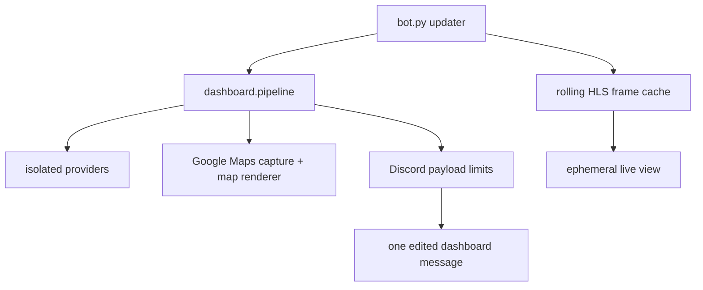

# Dashboard architecture

bot.py owns the Discord runtime: configuration, the presentation scheduler,
generation fencing, persistent-message discovery and recovery, status threads,
alerts, live-view button interactions, durable state, and the updater-owned
camera refresh task. It receives completed snapshots from dashboard.pipeline
and edits one message in place.

dashboard.diagnostics configures console and bounded rotating files explicitly
at startup. UTC timestamps, process/run IDs and a Python-source fingerprint
identify deployments without shelling out to Git. Formatters redact credentials,
URL queries and sensitive headers; exception traces retain call sites and cause
types without locals or source snippets. Discord wire-body debug logs remain
disabled. Runtime logs record message/thread lifecycle operations and delivery
outcomes, plus displayed availability transitions and five-minute health records.
The shared HTTP layer records failed attempts, request durations, retry evidence
and stale cache ages. Maps keeps only four recent sanitized page request failures
and logs cache/expiry/warming reasons; repeated identical fallback warnings are
demoted to debug. Logging does not change retries, source TTLs or freshness bounds.

dashboard.pipeline coordinates isolated provider calls using the injected
HttpClient. Transit, weather, traffic, and tracked-road results can publish
retained or fresh data independently. Route geometry is refreshed and consumed
by the map stage; it is not one of collect_all's published provider results.
Presentation defaults to a 10-second interval; provider refresh gates are
longer and independent. The map stage combines transit estimates, route
geometry, traffic evidence, and the latest completed Google Maps Playwright
capture before adapting the result for dashboard.render.

Map results carry separate canvas-export and verified-page timestamps through
the renderer. The active page is exported each 10-second presentation cycle;
a second page begins warming at 20 seconds of active-page age and replaces it
only after complete, stable canvas checks. The page/base has a hard one-minute lifetime, independent
of repeated exports. Failed captures retry after 10 seconds; retained fallback
is labelled, and exports older than 30 seconds are stale. Neither render time
nor disk writes can extend the verified page's freshness.
The embed timestamp is the only displayed map clock. Internal overlay render
times never extend the Google base's lifetime. The legend shows live ETA samples for all
operators and scheduled samples for KMB and GMB only.
The renderer preserves the map's first embed slot for initializing and unavailable
states. A map outage is removed from the general source-status pane once shown
there, while other provider failures remain visible.

Traffic notices combine TD's full special-news page and RTHK's current Chinese
traffic-news page, independently cached for 60 seconds. The incomplete special
news XML feed is excluded from runtime collection; it cannot establish the
current active list. Reports are attributed and
matched by road aliases in their text. Timestamped RTHK reports expire after a
configurable three-hour window, rechecked during collection, presentation, map
annotations and alert delivery. TD remains governed by current-page membership.
Expiry does not establish clearance. Clearance reports remain visible, but
do not produce affected-road rails or congestion role pings. Each TD report
carries the page update clock, explicitly distinguished from RTHK's per-report
publication time. The two TD locale pages are fetched concurrently: equal page
clocks/counts and unique road/cause/state pairs permit official Chinese sidecars.
Cross-source grouping additionally requires exact direction/landmark/state and
a unique report pair within three hours. The finite Tseng Lan Shue Chinese name
variants share one landmark identity. Grouping retains both attributed texts;
ambiguous or conflicting reports stay separate. Source checks remain internal
freshness metadata rather than a repeated timestamp on each link.

dashboard.providers.traffic_location resolves explicit landmarks using exact
bilingual names from LandsD Location Search and converts HK80 to WGS84 with
pyproj. It compares the reported section/direction with official bus paths.
The complete named-road query is independent of the route-envelope road cache:
only complete pagination can support road-coverage estimates. Without an
explicit location, at least 50% length-weighted coverage permits a likely-affected
bus label. Failed/ambiguous explicit locations retain the notice but no bus list;
road-only estimates never create whole-road incident rails. Bounded place and
geometry caches last seven days; failures retry after 30 minutes.

Tracked-road membership uses sustained, heading-aligned overlap between
official bus routes and OSM road geometry. The official LandsD Road Centreline
API is the geometry fallback when Overpass is unavailable; bounded paginated
queries finish before replacing the last-good table, and CPU-heavy association
runs outside the event loop. Its independent bilingual name dictionary loads
cached data immediately, refreshes once on startup and then every 24 hours,
and keeps the last good result for at most 90 days. Complete normalized English
names join to official Chinese names; longest-alias matching distinguishes
Clear Water Bay Road from New Clear Water Bay Road in either language.

Status-thread sends retain their mention permission alongside the queued text,
including retries. Weather warnings, general road reports, and clearance updates
allow no mentions. Only a congestion start on either Clear Water Bay road may
allow the configured traffic role; all user/everyone mentions remain disabled.
Startup diagnoses whether Discord permissions permit that role to be mentioned.
Thread identity follows the dashboard starter-message ID. Reuse its attached
thread or create one through the message; an unrelated saved thread is never
adopted. There is no age-based message replacement. Edit-limit responses defer
edits of the same message using Discord retry metadata, with a 60-second fallback;
thread updates continue. Thread creation handles an already-created race by
fetching the starter ID and uses the channel default archive interval.
Unarchiving retains discord.py's returned thread object. A replacement for a
confirmed missing dashboard gets its own attached thread, while queued
alerts retain their delivery policy.

HKO warning assets accept static PNG data only. A bounded composition cache
reuses the strip for unchanged icons. Discord edits retain matching attachment
objects and stable thumbnail CDN paths. Discord renews embed URL signatures
automatically, so signed query tokens are omitted without uploading unchanged bytes.
A missing attachment or changed icon set requires an upload: a CDN URL
alone cannot retain a file omitted from an edit. The static catalog can resolve
warnsum's official names even if wxwarntoday metadata is unavailable.

The map renderer draws the required traffic screenshot as its base, then adds
verified stop markers, estimated bus positions, route labels, and scoped
traffic annotations. Positions come from route geometry and ETA evidence and
are always estimates. ETA scheduled styling is based only on the ETA's
scheduled classification; position authority is separate evidence metadata.

dashboard.maps.label_layout owns box placement independently of projection and
drawing. Single and stacked bus labels share the same collision checks and
road-priority policy. The renderer supplies arrow footprints and separate masks
for named important roads and Google traffic pixels. If preferred label rows
cover a protected road, the solver checks a two-dimensional neighborhood within
96 logical pixels of the usual side positions before accepting overlap. The
canvas-wide fallback is reserved for label/arrow congestion; road avoidance is
best-effort when no local clear slot fits, so labels remain readable and nearby.
Traffic-pixel masks match Google's known canvas and legend palette with bounded
colour tolerance. Their cache key includes every pristine base pixel, so a new
traffic colour or cleared stroke updates both single and stacked label avoidance.

Current ETA cohorts determine displayed marker counts, coordinates and source
provenance every frame. MarkerTracker.present uses temporal identity only as a
hint: the stricter identity reconciliation in update cannot suppress a current
marker, retain a ghost, or freeze a corrected interpolation. Complete route
generations publish immediately after their final required physical request commits;
unrelated slow requests do not delay ready routes. KMB uses every stop returned
by its single route request. The production per-stop sampler seeds each route at
its final terminus. dashboard.providers.probe_plan walks upstream when a response
contains three or more ETAs and may conceal later buses. It returns whole local
query units, including extra stops needed to resolve zeroes. After each response,
the map estimator supplies updated local queries; source requests stay within the
existing total/GMB caps, pacing and cooldown. Physical-group service debt rotates
contested units. The provider's general checkpoint scheduler remains available to
explicit fixed-probe callers. Production positioning consumes responses younger
than 60 seconds and rereads completed work after map capture, without waiting for
the full background sweep. Source countdowns stay immutable between responses.
Gate rows retain absolute arrival times for matching responses collected at
different times; cached positive origin ETAs never age into departure evidence.
Observed stops, observed empty responses, and missing evidence remain distinct.
The read-only position auditor and live verifier inspect the actual displayed
markers. Scheduled-only or uncorroborated evidence is inconclusive. Distinct,
tightly bunched same-stop ETA rows stay separate unless their source identities
prove duplication; the public feeds do not establish physical vehicle identity.
The placement stages keep source-cohort association separate from provisional
common-stop spacing and final local checkpoint refinement. Any positive origin
ETA vetoes its associated cohort before spacing, including sub-minute future
departures. Local evidence has
precedence; coarse headways must not put a bus beyond its next positive-ETA
stop. ETA rank is per stop and can change with boarding or overtaking; it is
not a permanent vehicle ID or a fixed physical ordering. Map markers and
traffic-news bus lists use the shared compact destination vocabulary.
dashboard.maps.interpolation refines all operators after cohort association and
spacing, preserving marker multiplicity and scheduled styling. It matches the
whole arrival lists at consecutive stops on their absolute clocks. A still-future
upstream match moves the search upstream; a leading arrival absent upstream or
an exact signed due/future crossing can delimit a marker. A later unlisted row
may be hidden by the three-row limit and never proves passage. The median matched
arrival difference supplies local travel time, with an exact signed crossing for
that vehicle taking precedence. Position is the next stop minus the vehicle's
countdown divided by this travel time, projected along the official road path.
No fixed two-minute assumption supplies that denominator; coarse projections only
guide unresolved searches. Independently fetched boundary responses must be fresh;
absolute timestamps align staggered observations without advancing cached values
just because another frame is rendered. Rounded-only observations use half-minute
intervals. Measured edge travel times and neighbouring nonzero observations
constrain a common arrival-time offset for consecutive zeroes. Use the remaining
interval's centre, or the zero span's midpoint when unresolved; only a uniquely
delimited interval gains position authority. Exact API timestamps take precedence
over display rounding. Missing evidence retains a coarse estimate and requests
the actual local stops; it never changes a live marker to scheduled styling.

The live-view interaction reads the updater's rolling North/South HLS frame
cache. Background decoding runs about every 20 seconds with a bounded freshness
window; an interaction opens or refreshes an ephemeral snapshot and does not
block the Discord callback. Camera failure leaves the ordinary dashboard alive.

Shutdown drains updater tasks, then pipeline.shutdown_background_resources
closes browser, geometry, roads, and transit refresh resources before the shared
HTTP session. Camera decoding is owned by the updater and is stopped there;
the pipeline does not own camera decoding.

Remaining risks are upstream schema/availability changes, route-geometry
coverage during official extensions, and operational fencing of any legacy bot
instance. Historical private-source explorations and keyed campus datasets are
out of scope.
