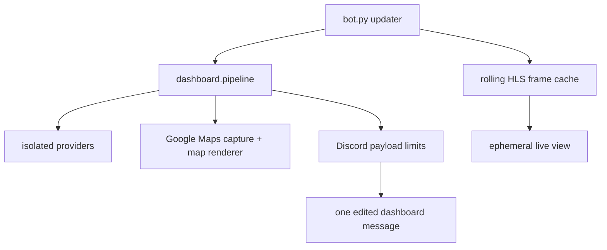

# Dashboard architecture

bot.py owns the Discord runtime: configuration, the presentation scheduler,
generation fencing, persistent-message discovery and recovery, status threads,
alerts, live-view button interactions, durable state, and the updater-owned
camera refresh task. It receives completed snapshots from dashboard.pipeline
and edits one message in place.

dashboard.pipeline coordinates isolated provider calls using the injected
HttpClient. Transit, weather, traffic, and tracked-road results can publish
retained or fresh data independently. Route geometry is refreshed and consumed
by the map stage; it is not one of collect_all's published provider results.
Presentation defaults to a 10-second interval; provider refresh gates are
longer and independent. The map stage combines transit estimates, route
geometry, traffic evidence, and the latest completed Google Maps Playwright
capture before adapting the result for dashboard.render.

The map renderer draws the required traffic screenshot as its base, then adds
verified stop markers, estimated bus positions, route labels, and scoped
traffic annotations. Positions come from route geometry and ETA evidence and
are always estimates. ETA scheduled styling is based only on the ETA's
scheduled classification; position authority is separate evidence metadata.

dashboard.maps.label_layout owns box placement independently of projection and
drawing. Single and stacked bus labels share the same collision checks and
road-priority policy. The renderer supplies arrow footprints and separate masks
for named important roads and Google traffic pixels. If preferred label rows
cover a protected road, the solver checks a two-dimensional neighborhood within
96 logical pixels of the usual side positions before accepting overlap. The
canvas-wide fallback is reserved for label/arrow congestion; road avoidance is
best-effort when no local clear slot fits, so labels remain readable and nearby.

The marker contract separates exact source ETA rows from position authority:
complete probe generations own marker births and deaths, while per-stop cache
evidence refines an existing position. Unchanged or stale data does not move a
vehicle. Observed stops, observed empty responses, and missing evidence remain
distinct, and the position auditor is read-only.

The live-view interaction reads the updater's rolling North/South HLS frame
cache. Background decoding runs about every 20 seconds with a bounded freshness
window; an interaction opens or refreshes an ephemeral snapshot and does not
block the Discord callback. Camera failure leaves the ordinary dashboard alive.

Shutdown drains updater tasks, then pipeline.shutdown_background_resources
closes browser, geometry, roads, and transit refresh resources before the shared
HTTP session. Camera decoding is owned by the updater and is stopped there;
the pipeline does not own camera decoding.

Remaining risks are upstream schema/availability changes, route-geometry
coverage during official extensions, and operational fencing of any legacy bot
instance. Historical private-source explorations and keyed campus datasets are
out of scope.
